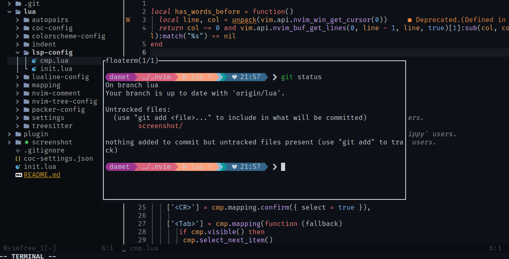

<h1 align="center">My DotFiles Config</h1>

### Genal
- Neovim (editor)
- zsh (shell)
- kitty (terminal)
- pycom (compositor)

repo de temas de kitty https://github.com/dexpota/kitty-themes.git

## Neovim config

Requires [Neovim](https://neovim.io/) (>= 0.7)]
Plugins manager [packer.nvim](https://github.com/wbthomason/packer.nvim#features)

### screenshot

## Zsh Config
Promp [Starship](https://starship.rs/)
Plugins
- **[zsh-autosuggestions](https://github.com/zsh-users/zsh-autosuggestions)**
- **[zsh-syntax-highlighting](https://github.com/zsh-users/zsh-syntax-highlighting)**
- **[zsh-sudo](https://github.com/ohmyzsh/ohmyzsh/blob/master/plugins/sudo/sudo.plugin.zsh)**
### screenshot

