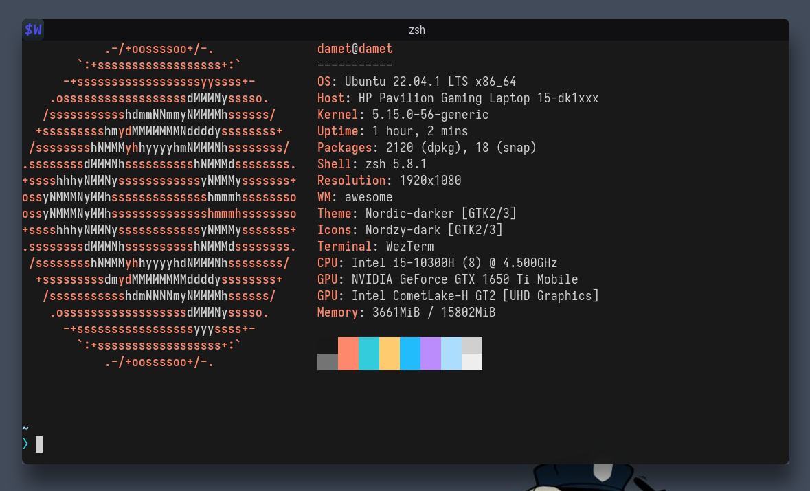

<h1 align="center">My DotFiles Config</h1>

### Genal

- WM - [AwesomeWM](https://awesomewm.org/)
- Editor - [Neovim](https://neovim.io/)
- SHell - [zsh](https://www.zsh.org/)
- Terminal - [Wezterm](https://wezfurlong.org/wezterm/)
- Bar - [Wibar](https://awesomewm.org/apidoc/popups_and_bars/awful.wibar.html)
- Compositor - [picom](https://github.com/yshui/picom)
- Icon theme - [Nordzy-icon](https://www.xfce-look.org/p/1686927/)
- Cursor theme - [Capitaine Cursors](https://www.xfce-look.org/p/1818760/)
- GTK theme - Awesthetic-gtk

<!-- repo de temas de kitty https://github.com/dexpota/kitty-themes.git -->

### Screenshots

 

---

 

# Neovim config

- Config - [NvChad](https://github.com/NvChad/NvChad)

### screenshot

- Theme - Aquarium

 

---

 

# Zsh Config
Prompt [Starship](https://starship.rs/)
Plugins
- **[zsh-autosuggestions](https://github.com/zsh-users/zsh-autosuggestions)**
- **[zsh-syntax-highlighting](https://github.com/zsh-users/zsh-syntax-highlighting)**
- **[zsh-sudo](https://github.com/ohmyzsh/ohmyzsh/blob/master/plugins/sudo/sudo.plugin.zsh)**
### screenshot

 

---

 

# Credits

 - [saimoomedits/dotfiles](https://github.com/saimoomedits/dotfiles)